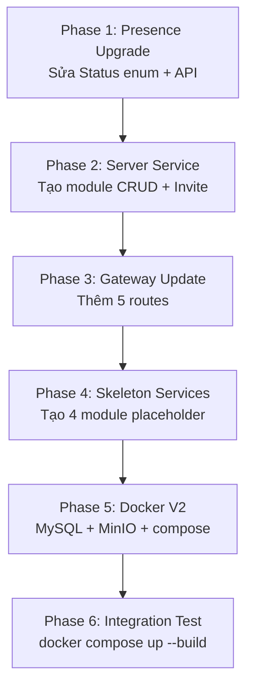

# 📋 Phân Tích Task: Làm Mới & Nâng Cấp Hạ Tầng

> **Nguồn:** `doc/01_yeu_cau_phan_mem.md`
> **Ngày:** 2026-05-07

---

## 1. Tổng Quan Task

Task gồm **3 phần lớn**, liên quan đến việc nâng cấp hệ thống từ trạng thái v1 (4 module hiện có) lên v2 (Discord-like):

| # | Phần | Mô tả |
|---|------|-------|
| **A** | CRUD Server Service + Invite Code | Tạo module `server-service` mới (8 API endpoints) |
| **B** | Update Gateway + Thêm status IDLE/DND | Mở 5 route mới trên Gateway + nâng cấp Presence Service |
| **C** | Docker V2 | Thêm MySQL, MinIO, 5 container mới vào docker-compose |

---

## 2. Phân Tích Hiện Trạng (AS-IS)

### 2.1. Modules đã có

| Module | Port | Trạng thái | DB |
|--------|------|------------|-----|
| `common-lib` | — | ✅ Build OK | — |
| `log-service` | 8084 | ✅ Chạy OK | H2 in-memory |
| `gateway-service` | 8080 | ✅ Chạy OK | Không có DB |
| `presence-service` | 8083 | ✅ Chạy OK | ConcurrentHashMap (in-memory) |

### 2.2. Gateway hiện tại — 4 routes

Xem `gateway-service/src/main/resources/application.yml`:

| Route ID | Path | URI |
|----------|------|-----|
| auth-service | `/api/auth/**` | `http://auth-service:8081` |
| messaging-ws | `/ws/chat/**` | `ws://messaging-ws:8082` |
| presence-service | `/api/presence/**` | `http://presence-service:8083` |
| log-service | `/api/logs/**` | `http://log-service:8084` |

### 2.3. Presence Status hiện tại

Xem `presence-service/src/main/java/com/chatsever/presence/model/UserStatus.java`:

```java
public enum Status {
    ONLINE, OFFLINE, AWAY   // ← Thiếu IDLE, DO_NOT_DISTURB, INVISIBLE
}
```

### 2.4. Docker Compose hiện tại

Xem `docker-compose.yml`:

- **Infra:** RabbitMQ (1 container)
- **Services:** log-service, gateway-service, presence-service (3 container)
- **Tổng:** 4 container
- **Thiếu:** MySQL, MinIO, và 5 service mới

---

## 3. Phân Tích Chi Tiết Từng Phần

### 📦 Phần A: CRUD Server Service + Invite Code

> **IMPORTANT:** Đây là module **hoàn toàn mới** — cần tạo từ đầu.

**Mapping yêu cầu → API (từ spec § C):**

| ID | Chức năng | HTTP Method | Endpoint | Ghi chú |
|----|-----------|-------------|----------|---------|
| SV1 | Tạo server | `POST` | `/api/servers` | Người tạo = Owner |
| SV2 | Danh sách server | `GET` | `/api/servers` | Trả servers user đã join |
| SV3 | Chi tiết server | `GET` | `/api/servers/{serverId}` | Kèm channels + members |
| SV4 | Cập nhật server | `PUT` | `/api/servers/{serverId}` | Chỉ Owner/Admin |
| SV5 | Xóa server | `DELETE` | `/api/servers/{serverId}` | Chỉ Owner |
| SV6 | Tham gia server | `POST` | `/api/servers/{serverId}/join` | Qua invite code |
| SV7 | Rời server | `POST` | `/api/servers/{serverId}/leave` | — |
| SV8 | Tạo invite code | `POST` | `/api/servers/{serverId}/invite` | Có expiry tùy chọn |

**Files cần tạo:**

```
server-service/
├── Dockerfile
├── pom.xml
└── src/main/
    ├── java/com/chatsever/server/
    │   ├── ServerApplication.java
    │   ├── config/
    │   │   └── RabbitMQConfig.java          # (optional — publish event log)
    │   ├── controller/
    │   │   └── ServerController.java        # 8 endpoints
    │   ├── dto/
    │   │   ├── CreateServerRequest.java
    │   │   ├── UpdateServerRequest.java
    │   │   ├── ServerResponse.java
    │   │   ├── InviteCodeResponse.java
    │   │   └── JoinServerRequest.java
    │   ├── exception/
    │   │   ├── GlobalExceptionHandler.java  # @ControllerAdvice
    │   │   ├── ServerNotFoundException.java
    │   │   └── UnauthorizedException.java
    │   ├── model/
    │   │   ├── Server.java                  # JPA Entity
    │   │   ├── ServerMember.java            # JPA Entity (user ↔ server)
    │   │   ├── InviteCode.java              # JPA Entity
    │   │   └── ServerRole.java              # Enum: OWNER, ADMIN, MODERATOR, MEMBER
    │   ├── repository/
    │   │   ├── ServerRepository.java
    │   │   ├── ServerMemberRepository.java
    │   │   └── InviteCodeRepository.java
    │   └── service/
    │       ├── ServerService.java
    │       └── InviteService.java
    └── resources/
        └── application.yml
```

**Thiết kế DB (MySQL):**

```sql
-- Bảng Server
CREATE TABLE servers (
    id          BIGINT AUTO_INCREMENT PRIMARY KEY,
    name        VARCHAR(100) NOT NULL,
    description VARCHAR(500),
    icon_url    VARCHAR(500),
    owner_id    VARCHAR(100) NOT NULL,       -- username của owner
    created_at  DATETIME DEFAULT CURRENT_TIMESTAMP,
    updated_at  DATETIME DEFAULT CURRENT_TIMESTAMP ON UPDATE CURRENT_TIMESTAMP
);

-- Bảng thành viên server
CREATE TABLE server_members (
    id         BIGINT AUTO_INCREMENT PRIMARY KEY,
    server_id  BIGINT NOT NULL,
    user_id    VARCHAR(100) NOT NULL,        -- username
    role       ENUM('OWNER','ADMIN','MODERATOR','MEMBER') DEFAULT 'MEMBER',
    joined_at  DATETIME DEFAULT CURRENT_TIMESTAMP,
    FOREIGN KEY (server_id) REFERENCES servers(id) ON DELETE CASCADE,
    UNIQUE KEY uk_server_user (server_id, user_id)
);

-- Bảng invite code
CREATE TABLE invite_codes (
    id          BIGINT AUTO_INCREMENT PRIMARY KEY,
    server_id   BIGINT NOT NULL,
    code        VARCHAR(20) NOT NULL UNIQUE, -- VD: "aBcD1234"
    created_by  VARCHAR(100) NOT NULL,
    expires_at  DATETIME,                    -- NULL = không hết hạn
    max_uses    INT,                         -- NULL = không giới hạn
    use_count   INT DEFAULT 0,
    created_at  DATETIME DEFAULT CURRENT_TIMESTAMP,
    FOREIGN KEY (server_id) REFERENCES servers(id) ON DELETE CASCADE
);
```

**Port:** `8085` (cần chọn port mới — chưa có trong quy ước)

> **WARNING:** Quy ước port hiện tại (§ 7.2 BAN_GIAO_TEAM.md) chỉ khai báo đến 8084. Cần chọn port cho 5 service mới:
> - `server-service`: **8085**
> - `channel-service`: **8086**
> - `user-profile-service`: **8087**
> - `notification-service`: **8088**
> - `file-service`: **8089**

---

### 🔀 Phần B: Update Gateway + Thêm Status

#### B1. Gateway — Thêm 5 Route Mới

**5 route mới cần thêm vào** `gateway-service/src/main/resources/application.yml`:

| # | Route ID | Path | URI | Service tương ứng |
|---|----------|------|-----|------|
| 1 | server-service | `/api/servers/**` | `http://server-service:8085` | Server Service (Phần A) |
| 2 | channel-service | `/api/channels/**` + `/api/servers/*/channels/**` | `http://channel-service:8086` | Channel Service |
| 3 | user-profile-service | `/api/users/**` | `http://user-profile-service:8087` | User Profile Service |
| 4 | notification-service | `/api/notifications/**` + `/api/channels/*/ack` | `http://notification-service:8088` | Notification Service |
| 5 | file-service | `/api/files/**` | `http://file-service:8089` | File Service |

> **NOTE:** Một số path có overlap (VD: `/api/servers/*/channels/**` thuộc channel-service nhưng prefix `/api/servers/**` thuộc server-service). Cần sắp xếp thứ tự route hoặc dùng predicate cụ thể hơn.

**File cần sửa:**
- `gateway-service/src/main/resources/application.yml`

#### B2. Presence Service — Thêm Status IDLE, DND

**Hiện tại:** `ONLINE, OFFLINE, AWAY`
**Yêu cầu (spec § I, P5):** `ONLINE, IDLE, DO_NOT_DISTURB, INVISIBLE`

**Files cần sửa:**

| File | Thay đổi |
|------|----------|
| `presence-service/.../model/UserStatus.java` | Sửa enum: bỏ `AWAY`, thêm `IDLE`, `DO_NOT_DISTURB`, `INVISIBLE` |
| `presence-service/.../service/PresenceService.java` | Cập nhật logic `getOnlineUsers()` để bao gồm cả `IDLE`, `DO_NOT_DISTURB` (không hiển thị `INVISIBLE`) |
| `presence-service/.../controller/PresenceController.java` | Thêm API `PUT /api/presence/status` để user tự đặt trạng thái |

**Enum mới:**
```java
public enum Status {
    ONLINE,           // Đang hoạt động
    IDLE,             // Vắng mặt (auto sau 5 phút không tương tác)
    DO_NOT_DISTURB,   // Không làm phiền (tắt notification)
    INVISIBLE,        // Ẩn (hiển thị offline nhưng vẫn nhận tin nhắn)
    OFFLINE           // Ngoại tuyến
}
```

---

### 🐳 Phần C: Docker V2 — MySQL + MinIO + 5 Container Mới

**Hiện tại:** 4 container (rabbitmq, log-service, gateway-service, presence-service)
**Mục tiêu:** 11+ container

#### C1. Infrastructure Containers Mới

| Container | Image | Port | Mục đích |
|-----------|-------|------|----------|
| `mysql` | `mysql:8.0` | `3306` | DB cho server-service, channel-service, user-profile-service, notification-service |
| `minio` | `minio/minio:latest` | `9000` (API), `9001` (Console) | Object storage cho file-service (S3-compatible) |

#### C2. Service Containers Mới (5 cái)

| # | Container | Port | DB | Ghi chú |
|---|-----------|------|-----|---------|
| 1 | `server-service` | 8085 | MySQL | **Phần A** — CRUD Server + Invite |
| 2 | `channel-service` | 8086 | MySQL | CRUD Channel trong Server |
| 3 | `user-profile-service` | 8087 | MySQL | Profile, avatar, custom status |
| 4 | `notification-service` | 8088 | MySQL | @mention, unread count |
| 5 | `file-service` | 8089 | MySQL + MinIO | Upload/download file |

#### C3. Docker Compose V2 — Cấu trúc mới

```yaml
# Tổng: 11 containers
services:
  # === INFRASTRUCTURE ===
  rabbitmq:        # (giữ nguyên)
  mysql:           # MỚI
  minio:           # MỚI

  # === EXISTING SERVICES ===
  log-service:     # (giữ nguyên, thêm env MYSQL nếu migrate)
  gateway-service: # (cập nhật routes)
  presence-service: # (cập nhật status enum)

  # === NEW SERVICES ===
  server-service:       # MỚI
  channel-service:      # MỚI
  user-profile-service: # MỚI
  notification-service: # MỚI
  file-service:         # MỚI
```

**Files cần tạo/sửa:**

| File | Hành động | Chi tiết |
|------|-----------|----------|
| `docker-compose.yml` | **SỬA** | Thêm mysql, minio, 5 service containers |
| `server-service/Dockerfile` | **TẠO** | Copy template từ gateway-service/Dockerfile |
| `channel-service/Dockerfile` | **TẠO** | Copy template |
| `user-profile-service/Dockerfile` | **TẠO** | Copy template |
| `notification-service/Dockerfile` | **TẠO** | Copy template |
| `file-service/Dockerfile` | **TẠO** | Copy template |
| `pom.xml` (root) | **SỬA** | Thêm 5 modules vào `<modules>` |

---

## 4. Tổng Hợp Files Cần Thay Đổi

### Files SỬA (modify)

| # | File | Phần | Thay đổi |
|---|------|------|----------|
| 1 | `gateway-service/.../application.yml` | B1 | +5 routes |
| 2 | `presence-service/.../UserStatus.java` | B2 | Sửa enum Status |
| 3 | `presence-service/.../PresenceService.java` | B2 | Logic filter INVISIBLE |
| 4 | `presence-service/.../PresenceController.java` | B2 | +1 API endpoint PUT /status |
| 5 | `docker-compose.yml` | C | +mysql, +minio, +5 services |
| 6 | `pom.xml` (root) | C | +5 modules trong `<modules>` |

### Files TẠO MỚI (create)

| # | File/Thư mục | Phần | Ghi chú |
|---|-------------|------|---------|
| 1 | `server-service/` (toàn bộ module ~15 files) | A | Module chính của task |
| 2–5 | `channel-service/`, `user-profile-service/`, `notification-service/`, `file-service/` | C | Skeleton (Dockerfile + pom.xml + Application.java + application.yml) |

---

## 5. Thứ Tự Thực Hiện Đề Xuất



| Phase | Effort | Mô tả |
|-------|--------|-------|
| **Phase 1** | 🟢 Nhỏ | Sửa 3 file trong presence-service |
| **Phase 2** | 🔴 Lớn | Tạo ~15 file Java mới cho server-service |
| **Phase 3** | 🟢 Nhỏ | Thêm YAML config vào gateway |
| **Phase 4** | 🟡 Trung bình | Tạo skeleton cho 4 service (Dockerfile + pom + main class) |
| **Phase 5** | 🟡 Trung bình | Viết docker-compose V2 với mysql, minio, volumes, healthchecks |
| **Phase 6** | 🟡 Trung bình | Build + chạy + debug integration |

---

## 6. Rủi Ro & Lưu Ý

> **WARNING — Chưa có auth-service / messaging-service** trong codebase. Gateway hiện khai báo route đến `auth-service:8081` và `messaging-ws:8082` nhưng các module này chưa tồn tại. Task này tập trung vào server-service và hạ tầng, không bao gồm auth/messaging.

> **CAUTION — MySQL migration:** Các service hiện tại (log-service, presence-service) dùng H2/in-memory. Yêu cầu spec nói "H2 (dev) / MySQL (production)". Cần quyết định:
> - **Option A:** Service mới dùng MySQL, service cũ giữ H2 → dễ làm, ít rủi ro
> - **Option B:** Migrate tất cả sang MySQL → cần thêm effort sửa log-service + presence-service

> **NOTE — Invite code generation:** Cần thuật toán sinh mã mời ngẫu nhiên (VD: 8 ký tự alphanumeric). Nên đặt trong `InviteService` với `SecureRandom`.

---

## 7. Câu Hỏi Cần Xác Nhận

1. **Port cho service mới?** Đề xuất 8085–8089, bạn đồng ý không?
2. **Bắt đầu từ phase nào trước?** Đề xuất Phase 1 (nhỏ, dễ) → Phase 2 (core) → Phase 3–6.
3. **Service mới dùng MySQL hay H2 cho dev?** Spec nói H2 cho dev, MySQL cho production — bạn muốn cấu hình dual profile không?
4. **4 skeleton services (channel, user-profile, notification, file)** — tạo đầy đủ CRUD hay chỉ Dockerfile + main class placeholder?
5. **Giữ `docker-compose.full.yml` hay merge vào `docker-compose.yml` chính?**
