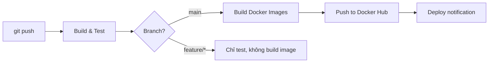

# 🛠️ Thiết Kế DevOps — Chat Server Microservices

> **Ngày:** 2026-05-07 · **Phiên bản:** v2 (Discord-like, 11 services)

---

## 1. Tổng Quan Kiến Trúc DevOps

```
┌─────────────────────────────────────────────────────────────────┐
│                        DEVELOPER                                │
│  git push ──► GitHub ──► GitHub Actions (CI) ──► Docker Hub     │
└────────────────────────────────┬────────────────────────────────┘
                                 │
                    ┌────────────▼────────────┐
                    │    Docker Compose (CD)   │
                    │  ┌─────┐ ┌─────┐ ┌────┐ │
                    │  │MySQL│ │MinIO│ │ MQ │ │  ◄── Infrastructure
                    │  └─────┘ └─────┘ └────┘ │
                    │  ┌─────────────────────┐ │
                    │  │ 8 Spring Boot JARs  │ │  ◄── Application
                    │  └─────────────────────┘ │
                    │  ┌──────┐ ┌───────────┐  │
                    │  │Nginx │ │Prometheus │  │  ◄── Observability
                    │  └──────┘ └───────────┘  │
                    └──────────────────────────┘
```

### 1.1. Hiện trạng DevOps

| Có rồi | Chưa có |
|--------|---------|
| ✅ Docker multi-stage build (3 Dockerfiles) | ❌ CI/CD pipeline (GitHub Actions) |
| ✅ docker-compose.yml (4 containers) | ❌ Environment profiles (dev/staging/prod) |
| ✅ Maven Wrapper (reproducible build) | ❌ Monitoring & Health dashboard |
| ✅ `.gitignore` chuẩn | ❌ Centralized logging |
| ✅ Healthcheck cho RabbitMQ | ❌ Secrets management (.env) |
|  | ❌ Reverse proxy (Nginx) |
|  | ❌ Volume strategy cho data persistence |

---

## 2. Môi Trường (Environments)

### 2.1. Ba môi trường

| Env | Mục đích | DB | File Storage | Cách chạy |
|-----|----------|-----|-------------|-----------|
| **dev** | Code local, debug | H2 in-memory | Local filesystem | `./mvnw spring-boot:run` |
| **docker** | Integration test | MySQL container | MinIO container | `docker compose up` |
| **prod** | Deploy thật | MySQL managed | MinIO / S3 | `docker compose -f docker-compose.prod.yml up` |

### 2.2. Spring Profiles

Mỗi service có 3 file config:

```
src/main/resources/
├── application.yml              # Config chung (tên app, jackson, logging)
├── application-dev.yml          # H2, localhost, debug logging
└── application-docker.yml       # MySQL container, MinIO container
```

Kích hoạt qua env var trong docker-compose:

```yaml
environment:
  SPRING_PROFILES_ACTIVE: docker
```

### 2.3. File `.env` — Secrets tập trung

```bash
# .env (root, KHÔNG commit — đã thêm vào .gitignore)

# MySQL
MYSQL_ROOT_PASSWORD=chat_root_2026
MYSQL_DATABASE=chatserver
MYSQL_USER=chatapp
MYSQL_PASSWORD=chatapp_secret

# MinIO
MINIO_ROOT_USER=minioadmin
MINIO_ROOT_PASSWORD=minioadmin_secret

# RabbitMQ
RABBITMQ_DEFAULT_USER=guest
RABBITMQ_DEFAULT_PASS=guest

# JWT (dùng chung cho auth-service + gateway)
JWT_SECRET=my-super-secret-key-change-in-production
```

Kèm file mẫu để team copy:

```bash
# .env.example (COMMIT file này)
MYSQL_ROOT_PASSWORD=change_me
MYSQL_DATABASE=chatserver
MYSQL_USER=chatapp
MYSQL_PASSWORD=change_me
MINIO_ROOT_USER=minioadmin
MINIO_ROOT_PASSWORD=change_me
RABBITMQ_DEFAULT_USER=guest
RABBITMQ_DEFAULT_PASS=guest
JWT_SECRET=change_me
```

---

## 3. CI/CD Pipeline — GitHub Actions

### 3.1. Tổng quan pipeline



### 3.2. Workflow file

File: `.github/workflows/ci.yml`

```yaml
name: CI Pipeline

on:
  push:
    branches: [main, develop]
  pull_request:
    branches: [main]

env:
  JAVA_VERSION: '17'
  DOCKER_REGISTRY: docker.io
  DOCKER_NAMESPACE: chatsever

jobs:
  # ──────────────── Job 1: Build & Test ────────────────
  build-test:
    runs-on: ubuntu-latest
    steps:
      - uses: actions/checkout@v4

      - name: Setup Java 17
        uses: actions/setup-java@v4
        with:
          distribution: temurin
          java-version: ${{ env.JAVA_VERSION }}
          cache: maven

      - name: Build & Test all modules
        run: ./mvnw clean verify -B

      - name: Upload test reports
        if: failure()
        uses: actions/upload-artifact@v4
        with:
          name: test-reports
          path: '**/target/surefire-reports/'

  # ──────────────── Job 2: Build Docker Images ────────────────
  docker-build:
    needs: build-test
    if: github.ref == 'refs/heads/main'
    runs-on: ubuntu-latest
    strategy:
      matrix:
        service:
          - log-service
          - gateway-service
          - presence-service
          - server-service
          - channel-service
          - user-profile-service
          - notification-service
          - file-service
    steps:
      - uses: actions/checkout@v4

      - name: Login to Docker Hub
        uses: docker/login-action@v3
        with:
          username: ${{ secrets.DOCKER_USERNAME }}
          password: ${{ secrets.DOCKER_TOKEN }}

      - name: Build & Push ${{ matrix.service }}
        uses: docker/build-push-action@v5
        with:
          context: .
          file: ${{ matrix.service }}/Dockerfile
          push: true
          tags: |
            ${{ env.DOCKER_NAMESPACE }}/${{ matrix.service }}:latest
            ${{ env.DOCKER_NAMESPACE }}/${{ matrix.service }}:${{ github.sha }}
```

### 3.3. Branch strategy

| Branch | Mục đích | CI | CD |
|--------|----------|-----|-----|
| `main` | Stable release | ✅ Build + Test + Docker push | Auto deploy (nếu có server) |
| `develop` | Integration | ✅ Build + Test | — |
| `feature/*` | Tính năng mới | ✅ Build + Test (PR only) | — |

---

## 4. Docker Compose V2 — Production-Ready

### 4.1. Cấu trúc file

```
chat-server-microservices/
├── docker-compose.yml           # Dev/Integration (build from source)
├── docker-compose.prod.yml      # Production (pull from registry)
├── .env.example                 # Template secrets
├── .env                         # Actual secrets (gitignored)
└── infra/
    ├── mysql/
    │   └── init.sql             # Tạo DB cho từng service
    ├── minio/
    │   └── create-buckets.sh    # Tạo bucket mặc định
    └── nginx/
        └── nginx.conf           # Reverse proxy config
```

### 4.2. docker-compose.yml — Bản đầy đủ

```yaml
services:

  # ═══════════════ INFRASTRUCTURE ═══════════════

  rabbitmq:
    image: rabbitmq:3-management
    container_name: chat-rabbitmq
    ports:
      - "5672:5672"
      - "15672:15672"
    environment:
      RABBITMQ_DEFAULT_USER: ${RABBITMQ_DEFAULT_USER:-guest}
      RABBITMQ_DEFAULT_PASS: ${RABBITMQ_DEFAULT_PASS:-guest}
    volumes:
      - rabbitmq-data:/var/lib/rabbitmq
    healthcheck:
      test: ["CMD", "rabbitmq-diagnostics", "ping"]
      interval: 10s
      timeout: 5s
      retries: 10
    networks:
      - chat-net

  mysql:
    image: mysql:8.0
    container_name: chat-mysql
    ports:
      - "3306:3306"
    environment:
      MYSQL_ROOT_PASSWORD: ${MYSQL_ROOT_PASSWORD}
      MYSQL_DATABASE: ${MYSQL_DATABASE:-chatserver}
      MYSQL_USER: ${MYSQL_USER:-chatapp}
      MYSQL_PASSWORD: ${MYSQL_PASSWORD}
    volumes:
      - mysql-data:/var/lib/mysql
      - ./infra/mysql/init.sql:/docker-entrypoint-initdb.d/init.sql
    healthcheck:
      test: ["CMD", "mysqladmin", "ping", "-h", "localhost"]
      interval: 10s
      timeout: 5s
      retries: 10
    networks:
      - chat-net

  minio:
    image: minio/minio:latest
    container_name: chat-minio
    ports:
      - "9000:9000"
      - "9001:9001"
    environment:
      MINIO_ROOT_USER: ${MINIO_ROOT_USER:-minioadmin}
      MINIO_ROOT_PASSWORD: ${MINIO_ROOT_PASSWORD:-minioadmin}
    command: server /data --console-address ":9001"
    volumes:
      - minio-data:/data
    healthcheck:
      test: ["CMD", "curl", "-f", "http://localhost:9000/minio/health/live"]
      interval: 10s
      timeout: 5s
      retries: 5
    networks:
      - chat-net

  # ═══════════════ APPLICATION SERVICES ═══════════════

  gateway-service:
    build:
      context: .
      dockerfile: gateway-service/Dockerfile
    container_name: chat-gateway
    ports:
      - "8080:8080"
    depends_on:
      rabbitmq:
        condition: service_healthy
    networks:
      - chat-net

  log-service:
    build:
      context: .
      dockerfile: log-service/Dockerfile
    container_name: chat-log
    ports:
      - "8084:8084"
    environment:
      SPRING_RABBITMQ_HOST: rabbitmq
    depends_on:
      rabbitmq:
        condition: service_healthy
    volumes:
      - ./log-service/logs:/app/logs
    networks:
      - chat-net

  presence-service:
    build:
      context: .
      dockerfile: presence-service/Dockerfile
    container_name: chat-presence
    ports:
      - "8083:8083"
    environment:
      SPRING_RABBITMQ_HOST: rabbitmq
    depends_on:
      rabbitmq:
        condition: service_healthy
    networks:
      - chat-net

  server-service:
    build:
      context: .
      dockerfile: server-service/Dockerfile
    container_name: chat-server-svc
    ports:
      - "8085:8085"
    environment:
      SPRING_PROFILES_ACTIVE: docker
      SPRING_DATASOURCE_URL: jdbc:mysql://mysql:3306/chatserver_servers
      SPRING_DATASOURCE_USERNAME: ${MYSQL_USER:-chatapp}
      SPRING_DATASOURCE_PASSWORD: ${MYSQL_PASSWORD}
      SPRING_RABBITMQ_HOST: rabbitmq
    depends_on:
      mysql:
        condition: service_healthy
      rabbitmq:
        condition: service_healthy
    networks:
      - chat-net

  # (Tương tự cho channel, user-profile, notification, file-service)

  # ═══════════════ VOLUMES ═══════════════

volumes:
  rabbitmq-data:
  mysql-data:
  minio-data:

networks:
  chat-net:
    driver: bridge
```

### 4.3. MySQL Init Script

File: `infra/mysql/init.sql`

```sql
-- Tạo database riêng cho mỗi service (Database-per-Service pattern)
CREATE DATABASE IF NOT EXISTS chatserver_servers;
CREATE DATABASE IF NOT EXISTS chatserver_channels;
CREATE DATABASE IF NOT EXISTS chatserver_users;
CREATE DATABASE IF NOT EXISTS chatserver_notifications;
CREATE DATABASE IF NOT EXISTS chatserver_files;

-- Grant quyền
GRANT ALL PRIVILEGES ON chatserver_servers.* TO 'chatapp'@'%';
GRANT ALL PRIVILEGES ON chatserver_channels.* TO 'chatapp'@'%';
GRANT ALL PRIVILEGES ON chatserver_users.* TO 'chatapp'@'%';
GRANT ALL PRIVILEGES ON chatserver_notifications.* TO 'chatapp'@'%';
GRANT ALL PRIVILEGES ON chatserver_files.* TO 'chatapp'@'%';
FLUSH PRIVILEGES;
```

### 4.4. MinIO Bucket Init

File: `infra/minio/create-buckets.sh`

```bash
#!/bin/bash
# Chạy sau khi MinIO ready — tạo bucket mặc định
mc alias set local http://minio:9000 $MINIO_ROOT_USER $MINIO_ROOT_PASSWORD
mc mb --ignore-existing local/chat-avatars
mc mb --ignore-existing local/chat-files
mc anonymous set download local/chat-avatars  # Avatar public read
```

---

## 5. Monitoring & Observability

### 5.1. Stack đề xuất

| Tầng | Tool | Mục đích |
|------|------|----------|
| **Metrics** | Prometheus + Grafana | CPU, memory, request rate, JVM |
| **Health** | Spring Actuator | `/actuator/health`, `/actuator/info` |
| **Logging** | Loki + Grafana | Centralized log từ tất cả containers |
| **Tracing** | Zipkin (optional) | Distributed tracing giữa services |

### 5.2. Spring Actuator (mỗi service)

Thêm vào `application.yml` chung:

```yaml
management:
  endpoints:
    web:
      exposure:
        include: health,info,prometheus,metrics
  endpoint:
    health:
      show-details: when-authorized
  metrics:
    tags:
      application: ${spring.application.name}
```

Dependency cần thêm trong POM:

```xml
<dependency>
    <groupId>org.springframework.boot</groupId>
    <artifactId>spring-boot-starter-actuator</artifactId>
</dependency>
<!-- Prometheus exporter (optional) -->
<dependency>
    <groupId>io.micrometer</groupId>
    <artifactId>micrometer-registry-prometheus</artifactId>
</dependency>
```

### 5.3. Health Check Dashboard (đơn giản)

Script kiểm tra nhanh tất cả services:

File: `scripts/health-check.sh`

```bash
#!/bin/bash
# Kiểm tra health tất cả services
SERVICES=(
  "gateway-service:8080"
  "log-service:8084"
  "presence-service:8083"
  "server-service:8085"
  "channel-service:8086"
  "user-profile-service:8087"
  "notification-service:8088"
  "file-service:8089"
)

echo "══════ Health Check Dashboard ══════"
for svc in "${SERVICES[@]}"; do
  name="${svc%%:*}"
  port="${svc##*:}"
  status=$(curl -s -o /dev/null -w "%{http_code}" "http://localhost:$port/actuator/health" 2>/dev/null)
  if [ "$status" = "200" ]; then
    echo "  ✅ $name (port $port) — UP"
  else
    echo "  ❌ $name (port $port) — DOWN (HTTP $status)"
  fi
done
echo "════════════════════════════════════"
```

---

## 6. Dockerfile Template Chuẩn Hóa

Mỗi service mới copy template này, chỉ sửa 3 chỗ đánh dấu `<MODULE>`:

```dockerfile
# syntax=docker/dockerfile:1.6
# ── Build ──
FROM eclipse-temurin:17-jdk-jammy AS build
WORKDIR /build

COPY mvnw mvnw.cmd pom.xml ./
COPY .mvn .mvn
RUN chmod +x mvnw && sed -i 's/\r$//' mvnw

# Copy tất cả modules (Maven reactor cần thấy sibling modules)
COPY common-lib common-lib
COPY <MODULE> <MODULE>
# Thêm module phụ thuộc khác nếu cần

RUN ./mvnw -pl <MODULE> -am clean package -DskipTests

# ── Runtime ──
FROM eclipse-temurin:17-jre-jammy
WORKDIR /app
COPY --from=build /build/<MODULE>/target/<MODULE>-1.0.0-SNAPSHOT.jar app.jar

ENV TZ=Asia/Ho_Chi_Minh
EXPOSE <PORT>
ENTRYPOINT ["sh","-c","java $JAVA_OPTS -jar /app/app.jar"]
```

> **Vấn đề hiện tại:** Mỗi Dockerfile COPY tất cả sibling modules → build context lớn, cache invalidation kém. Cải tiến ở § 6.1.

### 6.1. Tối ưu Docker build (nâng cao)

**Vấn đề:** Hiện tại mỗi Dockerfile copy toàn bộ source → thay đổi 1 file ở `log-service` sẽ invalidate cache của `gateway-service`.

**Giải pháp:** Dùng `.dockerignore` + copy chọn lọc:

File: `.dockerignore`

```
**/target/
**/.git/
**/.idea/
**/logs/
**/*.md
doc/
.vs/
```

---

## 7. Convenience Scripts

### 7.1. Makefile

File: `Makefile`

```makefile
.PHONY: build test up down logs health clean

# Build tất cả modules (không Docker)
build:
	./mvnw clean package -DskipTests

# Chạy test
test:
	./mvnw clean verify

# Docker: build + start
up:
	docker compose up -d --build

# Docker: stop
down:
	docker compose down

# Docker: stop + xóa volumes
clean:
	docker compose down -v

# Xem logs
logs:
	docker compose logs -f --tail=100

# Health check
health:
	@bash scripts/health-check.sh

# Build 1 service cụ thể: make build-one S=server-service
build-one:
	./mvnw -pl $(S) -am clean package -DskipTests

# Rebuild 1 container: make rebuild S=server-service
rebuild:
	docker compose up -d --build $(S)
```

### 7.2. Tổng hợp lệnh thường dùng

| Tác vụ | Lệnh |
|--------|-------|
| Build tất cả | `make build` hoặc `./mvnw clean package -DskipTests` |
| Chạy tất cả (Docker) | `make up` hoặc `docker compose up -d --build` |
| Chạy 1 service local | `./mvnw -pl server-service spring-boot:run` |
| Xem log realtime | `make logs` hoặc `docker compose logs -f server-service` |
| Health check | `make health` |
| Dừng + xóa data | `make clean` |
| Rebuild 1 service | `make rebuild S=server-service` |

---

## 8. Quy Ước Port — Bản Cập Nhật V2

| Service | Port | Loại |
|---------|------|------|
| **gateway-service** | 8080 | Application |
| auth-service | 8081 | Application |
| messaging-service | 8082 | Application |
| **presence-service** | 8083 | Application |
| **log-service** | 8084 | Application |
| **server-service** | 8085 | Application (MỚI) |
| channel-service | 8086 | Application (MỚI) |
| user-profile-service | 8087 | Application (MỚI) |
| notification-service | 8088 | Application (MỚI) |
| file-service | 8089 | Application (MỚI) |
| RabbitMQ | 5672 / 15672 | Infra |
| MySQL | 3306 | Infra (MỚI) |
| MinIO | 9000 / 9001 | Infra (MỚI) |
| Prometheus | 9090 | Monitoring (tùy chọn) |
| Grafana | 3000 | Monitoring (tùy chọn) |

---

## 9. Tổng Hợp Files DevOps Cần Tạo

| # | File | Mục đích | Ưu tiên |
|---|------|----------|---------|
| 1 | `.env.example` | Template secrets | 🔴 Cao |
| 2 | `.dockerignore` | Tối ưu build context | 🔴 Cao |
| 3 | `infra/mysql/init.sql` | Tạo DB cho từng service | 🔴 Cao |
| 4 | `infra/minio/create-buckets.sh` | Tạo bucket MinIO | 🟡 TB |
| 5 | `.github/workflows/ci.yml` | CI pipeline | 🟡 TB |
| 6 | `Makefile` | Lệnh tắt cho team | 🟢 Thấp |
| 7 | `scripts/health-check.sh` | Dashboard health | 🟢 Thấp |
| 8 | `docker-compose.yml` | Cập nhật V2 | 🔴 Cao |
| 9 | `.gitignore` | Thêm `.env`, `infra/` logs | 🔴 Cao |

---

## 10. Roadmap DevOps

| Giai đoạn | Nội dung | Khi nào |
|-----------|----------|---------|
| **Phase 1** | `.env`, `.dockerignore`, `init.sql`, docker-compose V2 | Ngay bây giờ |
| **Phase 2** | GitHub Actions CI, Makefile, health-check script | Khi có 2+ services chạy |
| **Phase 3** | Prometheus + Grafana monitoring | Khi integration test ổn |
| **Phase 4** | Nginx reverse proxy, SSL/TLS | Khi deploy lên server thật |
| **Phase 5** | Kubernetes (nếu cần scale) | Tương lai xa |
